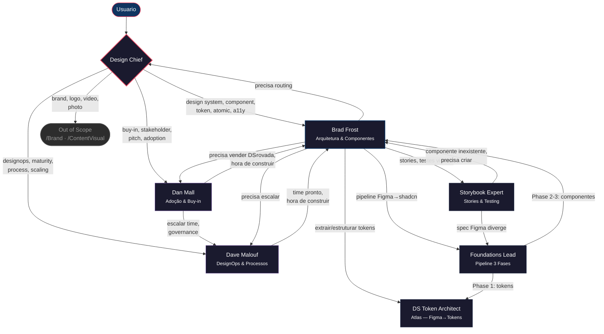
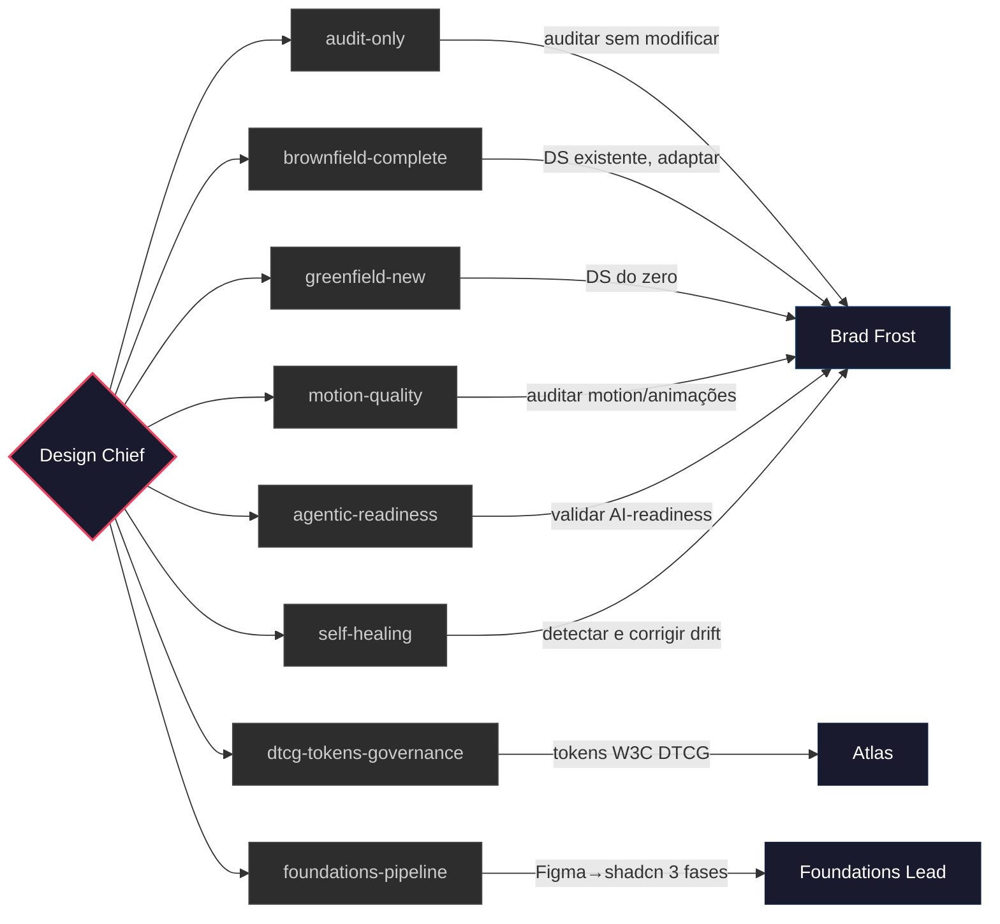
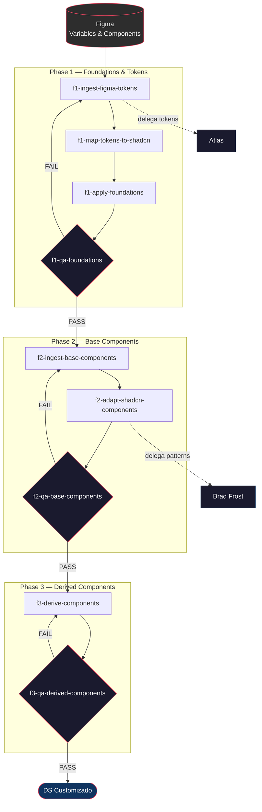

# Design System Squad — Governance Flow

## Overview

O squad opera com 7 agentes organizados em 3 camadas: orquestração, especialistas de domínio e especialistas técnicos. Todo request entra pelo **Design Chief**, que classifica, roteia e acompanha a execução.

---

## Fluxo Geral

---

## Camadas

### Camada 0 — Orquestração

| Agente | Papel | Nunca faz |
|--------|-------|-----------|
| **Design Chief** | Classifica requests como IN_SCOPE ou OUT_OF_SCOPE. Roteia para o especialista certo. Gerencia quality gates e handoffs entre agentes. | Implementar código, rodar audits, criar componentes |

### Camada 1 — Especialistas de Domínio

| Agente | Domínio | Entrega |
|--------|---------|---------|
| **Brad Frost** | Arquitetura DS, componentes, tokens, a11y, audits | Componentes, auditorias, migration strategies, documentação |
| **Dave Malouf** | DesignOps, processos, maturidade, scaling | Maturity assessments, métricas, team models, governance |
| **Dan Mall** | Stakeholder buy-in, adoção, exploração visual | Element Collages, stakeholder pitches, ROI arguments |

### Camada 2 — Especialistas Técnicos

| Agente | Domínio | Delegado por |
|--------|---------|--------------|
| **DS Token Architect (Atlas)** | Transformação Figma→tokens (JSON/CSS/TS) | Brad Frost, Foundations Lead |
| **Foundations Lead** | Pipeline 3 fases Figma→shadcn | Design Chief (via workflow) |
| **Storybook Expert** | Stories, interaction testing, visual regression | Brad Frost (após componente pronto) |

---

## Workflows Nomeados

O Design Chief seleciona o workflow baseado no tipo de request:

| Workflow | Quando usar | Agente principal |
|----------|-------------|------------------|
| `audit-only` | Auditar DS sem modificar código | Brad Frost |
| `brownfield-complete` | DS existente, adaptar/melhorar | Brad Frost |
| `greenfield-new` | Criar DS do zero | Brad Frost |
| `dtcg-tokens-governance` | Estruturar tokens no formato W3C DTCG | Atlas |
| `foundations-pipeline` | Pipeline completo Figma→shadcn (3 fases) | Foundations Lead |
| `motion-quality` | Auditar motion e animações | Brad Frost |
| `agentic-readiness` | Validar se DS está AI-ready | Brad Frost |
| `self-healing` | Detectar e corrigir drift automaticamente | Brad Frost |

---

## Foundations Pipeline (Detalhe)

O workflow mais complexo. Foundations Lead orquestra 3 fases sequenciais com QA gates bloqueantes:

**Regras do pipeline:**
- Cada fase tem um QA gate bloqueante — não avança sem PASS
- Phase 1 produz `globals.css` com tokens mapeados para CSS vars do shadcn
- Phase 2 adapta componentes base (Button, Input, Card, etc.) preservando props API e a11y
- Phase 3 deriva componentes compostos a partir dos base adaptados
- Cores sempre em OKLch. Dark mode parity obrigatória. Zero tokens inventados.

---

## Handoff entre Agentes

Cada agente sabe quando escalar ou delegar:

| De | Para | Quando |
|----|------|--------|
| **Qualquer agente** | Design Chief | Request fora do domínio do agente atual |
| Brad Frost | Dan Mall | Precisa vender o DS para stakeholders |
| Brad Frost | Dave Malouf | DS precisa de DesignOps (scaling, processos) |
| Brad Frost | Atlas | Componentes prontos, extrair tokens |
| Dan Mall | Brad Frost | Direção visual aprovada, hora de construir |
| Dan Mall | Dave Malouf | Buy-in obtido, precisa escalar o time |
| Dave Malouf | Brad Frost | Time estruturado, hora de construir |
| Storybook Expert | Brad Frost | Componente não existe, precisa criar |
| Storybook Expert | Foundations Lead | Spec Figma diverge do componente |
| Foundations Lead | Atlas | Token normalization (Phase 1) |
| Foundations Lead | Brad Frost | Component patterns (Phase 2-3) |

---

## Scope Boundaries

O Design Chief rejeita requests fora do escopo do squad:

| Request | Destino | Motivo |
|---------|---------|--------|
| Brand, logo, identidade visual | `/Brand` | Squad separado |
| Thumbnail, foto, vídeo, color grading | `/ContentVisual` | Squad separado |
| Pricing, positioning | `/Brand` | Estratégia de marca |

Tudo que envolve **tokens, componentes, a11y, stories, DesignOps ou adoção** é IN_SCOPE.
